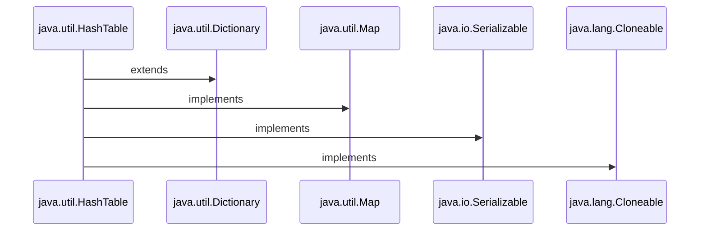

<h1>Java Collections : HashTable </h1>



<h3 align="Center">

```Syntax

public class Hashtable<K,V> extends Dictionary<K,V> implements Map<K,V>, Cloneable, Serializable

```

<h3>

<h1 align="Center"> HashTable </h1>

 <ul>
    
<h3> <li>1. The Hashtable class implements a hash table.</li></h3>

<h3> <li>2. A Hashtable is an array of a list. Each list is known as a Bucket. The position of the Bucket is identified by calling the <i><ins>HashCode()</ins></i> method.</li></h3> 


<h3> <li>3. Hashtable is synchronized.</li></h3>

<h3> <li>4. Hashtable stores key/value pair in Hash Table.</li></h3>

<h3> <li>5. A Hashtable contains values based on the key.</li></h3>

<h3> <li>6. Java Hashtable class doesn't allow null key or value.</li></h3>

<h3> <li>7. Java Hashtable class contains unique elements.</li></h3>

<h3> <li>8. In Hashtable we specify an object that is used as a key, and the value we want to associate to that key. The key is then hashed, and the resulting hash code is used as the index at which the value is stored within the table.</li></h3>

<h3> <li>9. The initial default capacity of Hashtable class is 11.</li></h3>

<h3> <li>10. The default loadFactor is 0.75 .</li></h3>

<h3> <li>11. HashMap doesn’t provide any Enumeration, while Hashtable provides not fail-fast Enumeration.</li></h3>
    
  </ul>
   
 <h1> </h1> 
   
<h1 align="Center"> Internal Workings of HashTable </h1>
 <ul>
    


<h3 align="Center"> <ins> Linked List </ins></i></h3>
   
 

<h3 align="Center"> <ins> Buckets </ins></i></h3>

<h3> <li> 1. As we can see that item composed of Key/Value = Item placed in each Slot / Bucket according to Index. </li> </h3>
    


<h3 align="Center"> <ins> Process of Insertion of Keys and Values</ins></i></h3>

<h3> <li> 2. Each Key is converted to Hash by calling hashcode() method. </li> </h3>
<h3> <li> 3. Next each converted hash coded key modulo (%) with no. of slots present in the array of buckets from which we get index of the Bucket at which we can store that particular Key/Value pair . And this process continues for each Key-Value pair .</li> </h3>
   
<h3> <i> Example: </i> </h3>
   
 ```Syntax
   
 For A Key-Value pair :
   
 Say Key is "A".
 Hash Code is: 65 (ASCII)
 
 Default Capacity of Hash Table = 11
 
 Index = 65 % 11 = 10 of Bucket
   
 ```
   
 <h2> </h2> 
 <h2 align="Center"> Load Factor </h2>
   
  <ul> 
  <h3> <li> Load Factor is calculated = Total No. of Entries in Hash Table / Total size of Hash Table. </li></h3> 
   <h3> <li> Or Load Factor = Total number of Elements / (Total number of Buckets/Slots) </li></h3>   
   <h3> <li> Suppose we need to enter 4 entries i.e., 4 is here the initial capacity or we can say total size of Hash Table.
But we have entered 3 entries , hence ¾ = 0.74 (Load Factor). 
 </li></h3>   
     
 <h3> <li> Default No. of Buckets / Default Capacity of Hash Table = 11.</li></h3>  
  <h3> <li> Default Load Factor of Hash Table = 0.75.</li></h3>  
  </ul> 
   
   <h2> </h2> 
 <h2 align="Center"> Need for Resizing of Bucket </h2>
   
 <ul>
 <h3> <li> Size of Hash Table(M) / No. of Buckets (N)> Load Factor = Need for Resizing. </li></h3>
    
 <h3> <i> Example: </i> </h3>
  
 <h3> <li>We have Table say of 9 slots: </li></h3>
 
 

   
 ```Syntax
   
 Now lets going with Default Load Factor and No. Of Buckets.
   
 Say Hash Table has a Size = 1(Number of Entries):
	1 / 11 = 0.091 < 0.75

 
Say Hash Table has a Size = 9 (Number of Entries):
	9 / 11 = 0.818 > 0.75

Hence it needs a resize of Hash Table.
    
Therefore,Resized Bucket: 9 x 2 = 18 slots .
   
 ```
 
<h3> <li>Hence increased Hash Table is:</li></h3>
    
 

 <h3> <li>Next such increase would be : 18 x2 = 36.  </li></h3>
 <h3> <i> And so on….  </i> </h3>
 </ul>
   
 </ul>
   
