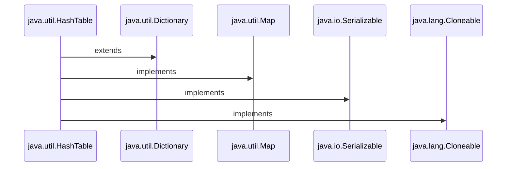

<h1>Java Collections : HashTable </h1>



<h3 align="Center">

```Syntax

public class Hashtable<K,V> extends Dictionary<K,V> implements Map<K,V>, Cloneable, Serializable

```

<h3>

<h1 align="Center"> HashTable </h1>

<h3> <li>1. The Hashtable class implements a hash table.</li></h3>

<h3> <li>2. A Hashtable is an array of a list. Each list is known as a Bucket. The position of the Bucket is identified by calling the <i><ins>HashCode()</ins></i> method.</li></h3> 


<h3> <li>3. Hashtable is synchronized.</li></h3>

<h3> <li>4. Hashtable stores key/value pair in Hash Table.</li></h3>

<h3> <li>5. A Hashtable contains values based on the key.</li></h3>

<h3> <li>6. Java Hashtable class doesn't allow null key or value.</li></h3>

<h3> <li>7. Java Hashtable class contains unique elements.</li></h3>

<h3> <li>8. In Hashtable we specify an object that is used as a key, and the value we want to associate to that key. The key is then hashed, and the resulting hash code is used as the index at which the value is stored within the table.</li></h3>

<h3> <li>9. The initial default capacity of Hashtable class is 11.</li></h3>

<h3> <li>10. The default loadFactor is 0.75 .</li></h3>

<h3> <li>11. HashMap doesn’t provide any Enumeration, while Hashtable provides not fail-fast Enumeration.</li></h3>
