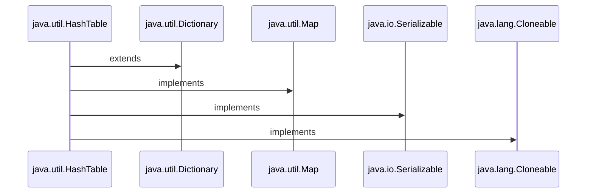

<h1>Java Collections : HashTable </h1>



<h3 align="Center">

```Syntax

public class Hashtable<K,V> extends Dictionary<K,V> 
		implements Map<K,V>, Cloneable, Serializable

```

<h3>

<h1 align="Center"> HashTable </h1>

 <ul>
    
<h3> <li>1. The Hashtable class implements a hash table.</li></h3>

<h3> <li>2. A Hashtable is an array of a list. Each list is known as a Bucket. The position of the Bucket is identified by calling the <i><ins>HashCode()</ins></i> method.</li></h3> 


<h3> <li>3. Hashtable is synchronized.</li></h3>

<h3> <li>4. Hashtable stores key/value pair in Hash Table.</li></h3>

<h3> <li>5. A Hashtable contains values based on the key.</li></h3>

<h3> <li>6. Java Hashtable class doesn't allow null key or value.</li></h3>

<h3> <li>7. Java Hashtable class contains unique elements.</li></h3>

<h3> <li>8. In Hashtable we specify an object that is used as a key, and the value we want to associate to that key. The key is then hashed, and the resulting hash code is used as the index at which the value is stored within the table.</li></h3>

<h3> <li>9. The initial default capacity of Hashtable class is 11.</li></h3>

<h3> <li>10. The default loadFactor is 0.75 .</li></h3>

<h3> <li>11. HashMap doesn’t provide any Enumeration, while Hashtable provides not fail-fast Enumeration.</li></h3>
    
  </ul>
   
 <h1> </h1> 
   
<h1 align="Center"> Internal Workings of HashTable </h1>
 <ul>
    


<h3 align="Center"> <ins> Linked List </ins></i></h3>
   
 

<h3 align="Center"> <ins> Buckets </ins></i></h3>

<h3> <li> 1. As we can see that item composed of Key/Value = Item placed in each Slot / Bucket according to Index. </li> </h3>
    


<h3 align="Center"> <ins> Process of Insertion of Keys and Values</ins></i></h3>

<h3> <li> 2. Each Key is converted to Hash by calling hashcode() method. </li> </h3>
<h3> <li> 3. Next each converted hash coded key modulo (%) with no. of slots present in the array of buckets from which we get index of the Bucket at which we can store that particular Key/Value pair . And this process continues for each Key-Value pair .</li> </h3>
   
<h3> <i> Example: </i> </h3>
   
 ```Syntax
   
 For A Key-Value pair :
   
 Say Key is "A".
 Hash Code is: 65 (ASCII)
 
 Default Capacity of Hash Table = 11
 
 Index = 65 % 11 = 10 of Bucket
   
 ```
   
 <h2> </h2> 
 <h2 align="Center"> Load Factor </h2>
   
  <ul> 
  <h3> <li> Load Factor is calculated = Total No. of Entries in Hash Table / Total size of Hash Table. </li></h3> 
   <h3> <li> Or Load Factor = Total number of Elements / (Total number of Buckets/Slots) </li></h3>   
   <h3> <li> Suppose we need to enter 4 entries i.e., 4 is here the initial capacity or we can say total size of Hash Table.
But we have entered 3 entries , hence ¾ = 0.75 (Load Factor). 
 </li></h3>   
     
 <h3> <li> Default No. of Buckets / Default Capacity of Hash Table = 11.</li></h3>  
  <h3> <li> Default Load Factor of Hash Table = 0.75.</li></h3>  
  </ul> 
   
   <h2> </h2> 
 <h2 align="Center"> Need for Resizing of Bucket </h2>
   
 <ul>
 <h3> <li> Size of Hash Table(M) / No. of Buckets (N)> Load Factor = Need for Resizing. </li></h3>
    
 <h3> <i> Example: </i> </h3>
  
 <h3> <li>We have Table say of 9 slots: </li></h3>
 
 

   
 ```Syntax
   
 Now lets going with Default Load Factor and No. Of Buckets.
   
 Say Hash Table has a Size = 1(Number of Entries):
	1 / 11 = 0.091 < 0.75

 
Say Hash Table has a Size = 9 (Number of Entries):
	9 / 11 = 0.818 > 0.75

Hence it needs a resize of Hash Table.
    
Therefore,Resized Bucket: 9 x 2 = 18 slots .
   
 ```
 
<h3> <li>Hence increased Hash Table is:</li></h3>
    
 

 <h3> <li>Next such increase would be : 18 x2 = 36.  </li></h3>
 <h3> <i> And so on….  </i> </h3>
 
 <h3> <li>But in Hash Table if 60% of Hash Table gets filled i.e. for default capacity 11 , it would be 6.6(6.6 /11 = 0.6 < 0.75) , Hash Table gets doubled. Here default threshold is 3/4 = 0.75 i.e. default load factor of Hash Table. </li></h3>
 </ul>
 
 <h2> </h2> 
 <h2 align="Center">Re-Hashing  </h2>
 
 <ul>
 <h3> <li>Basically, when the load factor increases to more than its pre-defined value (e.g. 0.75 as taken in above examples), the Time Complexity for search and insert increases.So to overcome this, the size of the array is increased(usually doubled) and all the values are hashed again and stored in the new double sized array to maintain a low load factor and low complexity. It copies all the element to a new array and make it the new bucket array.
</li></h3>
 
 
 </ul>
 
  <h2> </h2> 
 <h2 align="Center">Collision of Index  </h2>
 <ul>
  <h3> <li>Definition: A collision occurs when two keys get mapped to the same index.</li></h3>
  
  <h2> </h2> 
 <h2 align="Center">Handling Collisions </h2>
 <ul>
 <h3><li> <ins><i>1. Linear Probing:</i></ins> If a Key - Value pair is hashed to a slot which is already occupied, it searches linearly for the next free slot in the table.</li></h3>
 
 <h3><li> <ins><i>2.  Chaining: </i></ins> 
 During creation of Index, [ HashCode % No. Of Buckets = Index], if more than one index become same, then there creates a chance of collision. Hence it creates a Linked List on same index.
 
 <i>Suppose,</i> 
Index of Key 3 (K3) and Index of Key 4(K4) = 2 .
Then it creates a chance of collision, What it does is creating a Linked List at same index.


 </li></h3>
 
 <h3><li> <ins><i>3. Maintaining Threshold:</i></ins> A hash table with a threshold of 0.6 would resize when 60% of the space is occupied. As a convention, the size of the hash table is doubled. This can be memory intensive.</li></h3>
 
 </ul>
 </ul>
<h2> </h2> 
 <h2 align="Center">HashTable - A Thread Safe Property </h2>
 <ul>
<h3><li>1. Hashtable is synchronized and offers thread safety comparable to concurrentHashMap.</li></h3> 
 <h3><li>2.  Hashtable writes operations employ hashtable wide lock, which locks the whole hashtable object.</li></h3>


 </ul>
 
 </ul>
 
 <h1> </h1> 
 <h1 align="Center">Strengths And Weaknesses of Hash Table </h1>
	
<ul>

<table>
<tr>	
<th colspan="3">Time Complexity </th>
</tr>
<tr>	
<td>Operation </td>
<td>Average</td>
<td>Worst</td>
</tr>
<tr>	
<td>Search </td>
<td>O(1)</td>
<td>O(n)</td>
</tr>
<tr>	
<td>Insertion </td>
<td>O(1)</td>
<td>O(n)</td>
</tr>
<tr>	
<td>Deletion </td>
<td>O(1)</td>
<td>O(n)</td>
</tr>
<tr>	
<td>Space </td>
<td>O(n)</td>
<td>O(n)</td>
</tr>
</table>
	 
<h2> </h2> 
 <h2 align="Center">Strengths of Hash Table </h2>
<ul>
<h3><li> <i><ins> 1. Fast lookups : </ins></i> Lookups take O(1) time on average.</li></h3>
<h3><li> <i><ins> 2. Flexible keys : </ins></i> Most data types can be used for keys, as long as they’re  hashable . </li></h3>
</ul>
<h2> </h2> 
 <h2 align="Center">Weakness of Hash Table </h2>

<ul>
<h3><li> <i><ins> 1. Slow worst-case lookups : </ins></i> Lookups take O(n) time  in the worst case . </li></h3>
<h3><li> <i><ins> 2. Unordered : </ins></i> Keys aren’t stored in a special order. If you’re looking for the smallest key, the largest key, or all the keys in a range, you’ll need to look through every key to find it. </li></h3>
<h3><li> <i><ins> 3. Single-directional lookups : </ins></i> While we can look up the value for a given key in O(1) time, looking up the keys for a given value requires looping through the whole dataset—O(n) time. </li></h3>
<h3><li> <i><ins> 4. Not cache-friendly : </ins></i> Many hash table implementations use  linked lists , which don’t put data next to each other in memory. </li></h3>
</ul>
<ul>
	
</ul>
</ul>
	
<h1> </h1> 
 <h1 align="Center">Constructors of Hash Table </h1>
<ul>
</ul>
	
<h1> </h1> 
<h1 align="Center">Methods of Hash Table </h1>
<ul>
</ul>
