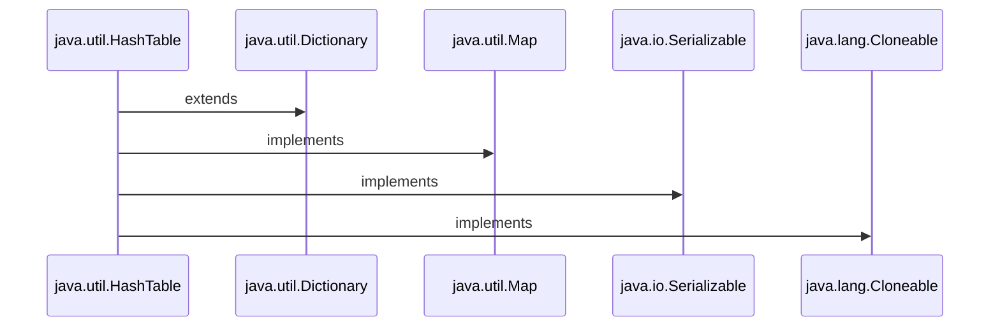
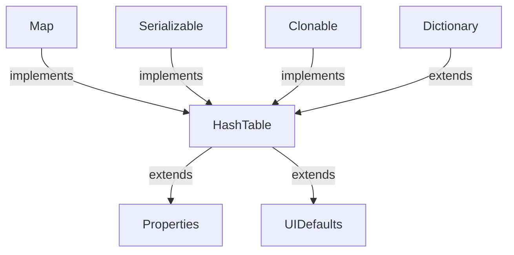
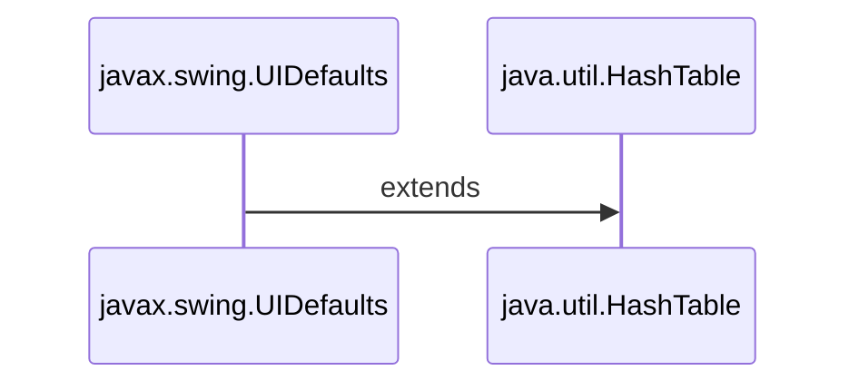
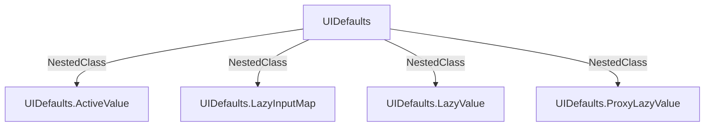
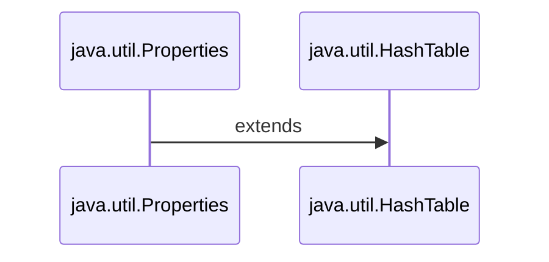

<h1>Java Collections : HashTable </h1>



<h3 align="Center">

```Syntax

public class Hashtable<K,V> extends Dictionary<K,V> 
		implements Map<K,V>, Cloneable, Serializable

```

<h3>

<h1 align="Center"> HashTable </h1>

 <ul>
    
<h3> <li>1. The Hashtable class implements a hash table.</li></h3>

<h3> <li>2. A Hashtable is an array of a list. Each list is known as a Bucket. The position of the Bucket is identified by calling the <i><ins>HashCode()</ins></i> method.</li></h3> 


<h3> <li>3. Hashtable is synchronized.</li></h3>

<h3> <li>4. Hashtable stores key/value pair in Hash Table.</li></h3>

<h3> <li>5. A Hashtable contains values based on the key.</li></h3>

<h3> <li>6. Java Hashtable class doesn't allow null key or value.</li></h3>

<h3> <li>7. Java Hashtable class contains unique elements.</li></h3>

<h3> <li>8. In Hashtable we specify an object that is used as a key, and the value we want to associate to that key. The key is then hashed, and the resulting hash code is used as the index at which the value is stored within the table.</li></h3>

<h3> <li>9. The initial default capacity of Hashtable class is 11.</li></h3>

<h3> <li>10. The default loadFactor is 0.75 .</li></h3>

<h3> <li>11. HashMap doesn’t provide any Enumeration, while Hashtable provides not fail-fast Enumeration.</li></h3>
    
  </ul>
   
 <h1> </h1> 
   
<h1 align="Center"> Internal Workings of HashTable </h1>
 <ul>
    


<h3 align="Center"> <ins> Linked List </ins></i></h3>
   
 

<h3 align="Center"> <ins> Buckets </ins></i></h3>

<h3> <li> 1. As we can see that item composed of Key/Value = Item placed in each Slot / Bucket according to Index. </li> </h3>
    


<h3 align="Center"> <ins> Process of Insertion of Keys and Values</ins></i></h3>

<h3> <li> 2. Each Key is converted to Hash by calling hashcode() method. </li> </h3>
<h3> <li> 3. Next each converted hash coded key modulo (%) with no. of slots present in the array of buckets from which we get index of the Bucket at which we can store that particular Key/Value pair . And this process continues for each Key-Value pair .</li> </h3>
   
<h3> <i> Example: </i> </h3>
   
 ```Syntax
   
 For A Key-Value pair :
   
 Say Key is "A".
 Hash Code is: 65 (ASCII)
 
 Default Capacity of Hash Table = 11
 
 Index = 65 % 11 = 10 of Bucket
   
 ```
   
 <h2> </h2> 
 <h2 align="Center"> Load Factor </h2>
   
  <ul> 
  <h3> <li> Load Factor is calculated = Total No. of Entries in Hash Table / Total size of Hash Table. </li></h3> 
   <h3> <li> Or Load Factor = Total number of Elements / (Total number of Buckets/Slots) </li></h3>   
   <h3> <li> Suppose we need to enter 4 entries i.e., 4 is here the initial capacity or we can say total size of Hash Table.
But we have entered 3 entries , hence ¾ = 0.75 (Load Factor). 
 </li></h3>   
     
 <h3> <li> Default No. of Buckets / Default Capacity of Hash Table = 11.</li></h3>  
  <h3> <li> Default Load Factor of Hash Table = 0.75.</li></h3>  
  </ul> 
   
   <h2> </h2> 
 <h2 align="Center"> Need for Resizing of Bucket </h2>
   
 <ul>
 <h3> <li> Size of Hash Table(M) / No. of Buckets (N)> Load Factor = Need for Resizing. </li></h3>
    
 <h3> <i> Example: </i> </h3>
  
 <h3> <li>We have Table say of 9 slots: </li></h3>
 
 

   
 ```Syntax
   
 Now lets going with Default Load Factor and No. Of Buckets.
   
 Say Hash Table has a Size = 1(Number of Entries):
	1 / 11 = 0.091 < 0.75

 
Say Hash Table has a Size = 9 (Number of Entries):
	9 / 11 = 0.818 > 0.75

Hence it needs a resize of Hash Table.
    
Therefore,Resized Bucket: 9 x 2 = 18 slots .
   
 ```
 
<h3> <li>Hence increased Hash Table is:</li></h3>
    
 

 <h3> <li>Next such increase would be : 18 x2 = 36.  </li></h3>
 <h3> <i> And so on….  </i> </h3>
 
 <h3> <li>But in Hash Table if 60% of Hash Table gets filled i.e. for default capacity 11 , it would be 6.6(6.6 /11 = 0.6 < 0.75) , Hash Table gets doubled. Here default threshold is 3/4 = 0.75 i.e. default load factor of Hash Table. </li></h3>
 </ul>
 
 <h2> </h2> 
 <h2 align="Center">Re-Hashing  </h2>
 
 <ul>
 <h3> <li>Basically, when the load factor increases to more than its pre-defined value (e.g. 0.75 as taken in above examples), the Time Complexity for search and insert increases.So to overcome this, the size of the array is increased(usually doubled) and all the values are hashed again and stored in the new double sized array to maintain a low load factor and low complexity. It copies all the element to a new array and make it the new bucket array.
</li></h3>
 
 
 </ul>
 
  <h2> </h2> 
 <h2 align="Center">Collision of Index  </h2>
 <ul>
  <h3> <li>Definition: A collision occurs when two keys get mapped to the same index.</li></h3>
  
  <h2> </h2> 
 <h2 align="Center">Handling Collisions </h2>
 <ul>
 <h3><li> <ins><i>1. Linear Probing:</i></ins> If a Key - Value pair is hashed to a slot which is already occupied, it searches linearly for the next free slot in the table.</li></h3>
 
 <h3><li> <ins><i>2.  Chaining: </i></ins> 
 During creation of Index, [ HashCode % No. Of Buckets = Index], if more than one index become same, then there creates a chance of collision. Hence it creates a Linked List on same index.
 
 <i>Suppose,</i> 
Index of Key 3 (K3) and Index of Key 4(K4) = 2 .
Then it creates a chance of collision, What it does is creating a Linked List at same index.


 </li></h3>
 
 <h3><li> <ins><i>3. Maintaining Threshold:</i></ins> A hash table with a threshold of 0.6 would resize when 60% of the space is occupied. As a convention, the size of the hash table is doubled. This can be memory intensive.</li></h3>
 
 </ul>
 </ul>
<h2> </h2> 
 <h2 align="Center">HashTable - A Thread Safe Property </h2>
 <ul>
<h3><li>1. Hashtable is synchronized and offers thread safety comparable to concurrentHashMap.</li></h3> 
 <h3><li>2.  Hashtable writes operations employ hashtable wide lock, which locks the whole hashtable object.</li></h3>


 </ul>
 
 </ul>
 
 <h1> </h1> 
 <h1 align="Center">Strengths And Weaknesses of Hash Table </h1>
	
<ul>

<table>
<tr>	
<th colspan="3">Time Complexity </th>
</tr>
<tr>	
<td>Operation </td>
<td>Average</td>
<td>Worst</td>
</tr>
<tr>	
<td>Search </td>
<td>O(1)</td>
<td>O(n)</td>
</tr>
<tr>	
<td>Insertion </td>
<td>O(1)</td>
<td>O(n)</td>
</tr>
<tr>	
<td>Deletion </td>
<td>O(1)</td>
<td>O(n)</td>
</tr>
<tr>	
<td>Space </td>
<td>O(n)</td>
<td>O(n)</td>
</tr>
</table>
	 
<h2> </h2> 
 <h2 align="Center">Strengths of Hash Table </h2>
<ul>
<h3><li> <i><ins> 1. Fast lookups : </ins></i> Lookups take O(1) time on average.</li></h3>
<h3><li> <i><ins> 2. Flexible keys : </ins></i> Most data types can be used for keys, as long as they’re  hashable . </li></h3>
</ul>
<h2> </h2> 
 <h2 align="Center">Weakness of Hash Table </h2>

<ul>
<h3><li> <i><ins> 1. Slow worst-case lookups : </ins></i> Lookups take O(n) time  in the worst case . </li></h3>
<h3><li> <i><ins> 2. Unordered : </ins></i> Keys aren’t stored in a special order. If you’re looking for the smallest key, the largest key, or all the keys in a range, you’ll need to look through every key to find it. </li></h3>
<h3><li> <i><ins> 3. Single-directional lookups : </ins></i> While we can look up the value for a given key in O(1) time, looking up the keys for a given value requires looping through the whole dataset—O(n) time. </li></h3>
<h3><li> <i><ins> 4. Not cache-friendly : </ins></i> Many hash table implementations use  linked lists , which don’t put data next to each other in memory. </li></h3>
</ul>
<ul>
	
</ul>
</ul>
	
<h1> </h1> 
 <h1 align="Center">Constructors of Hash Table </h1>
<ul>
<li><h3> <a href="https://github.com/AvinandanBose/Java-Collections-HashTable/blob/main/ConstructorJavaHashTable.java">1. Hashtable()</h3></li>

```Syntax

It creates an empty hashtable having the initial default capacity and load factor.

```

<li><h3> <a href="https://github.com/AvinandanBose/Java-Collections-HashTable/blob/main/ConstructorJavaHashTable1.java">2. Hashtable(int capacity)</h3></li>

```Syntax

It accepts an integer parameter and creates a hash table that contains a specified initial capacity.

```

<li><h3> <a href="https://github.com/AvinandanBose/Java-Collections-HashTable/blob/main/ConstructorJavaHashTable2.java">3. Hashtable(int capacity, float loadFactor)</h3></li>

```Syntax

It is used to create a hash table having the specified initial capacity and loadFactor.

```

<li><h3> <a href="https://github.com/AvinandanBose/Java-Collections-HashTable/blob/main/ConstructorJavaHashTable3.java">4. Hashtable(Map<? extends K,? extends V> m)</h3></li>

```Syntax

It creates a new hash table with the same mappings as the given Map.

```

<table>
<tr>
<th> Constructors </th>
<th> Does This</th>
</tr>

<tr>
<td> Hashtable() </td>
<td> It creates an empty hashtable having the initial default capacity and load factor.</td>
</tr>

<tr>
<td> Hashtable(int capacity) </td>
<td> It accepts an integer parameter and creates a hash table that contains a specified initial capacity.</td>
</tr>

<tr>
<td> Hashtable(int capacity, float loadFactor) </td>
<td> It is used to create a hash table having the specified initial capacity and loadFactor.</td>
</tr>

<tr>
<td> Hashtable(Map<? extends K,? extends V> m) </td>
<td> It creates a new hash table with the same mappings as the given Map.</td>
</tr>
</table>

</ul>
	
<h1> </h1> 
<h1 align="Center">Methods of Hash Table </h1>
<ul>
<li><h3> <a href="https://github.com/AvinandanBose/Java-Collections-HashTable/blob/main/MethodsofHashTable.java">1.Methods of Hash Table</h3></li>

<h3><i><ins>Note :<ins></i> These methods are already discussed  👉: <a href="https://github.com/AvinandanBose/Java-Collections-Map"> Here </a></h3> 

<li><h3> <a href="https://github.com/AvinandanBose/Java-Collections-HashTable/blob/main/MethodsofHashTable1.java">2.ReHash()</h3></li>

```Syntax

Increases the capacity of and internally reorganizes this hashtable, 
in order to accommodate and access its entries more efficiently.

```
<table>
<tr>
<th> New Method/s </th>
<th> Does This</th>
</tr>

<tr>
<th> ReHash() </th>
<th> Increases the capacity of and internally reorganizes this hashtable, 
in order to accommodate and access its entries more efficiently.</th>
</tr>

</table>
</ul>

<h1> </h1>
<h1 align="Center"> Diagram of HashTable </h1>



<h1> </h1>
<h1 align="Center"> A. UIDefaults Class</h1>



<h3 align="Center">

```Syntax

public class UIDefaults extends Hashtable<Object,Object>

```

</h3>

<ul>
<h3><li> <i> <ins> 1. Def: </ins> </i> A table of defaults for Swing components. Applications can set/get default values via the UIManager. </li></h3>

<h3><li>2. UIDefaults have some nested classes as discussed below . </li></h3>

<h2></h2>
<h2 align="Center"> Diagram of Nested Classes of UIDefaults </h2>
<ul>



</ul>

<h2></h2>
<h2 align="Center"> Description of Nested Classes of UIDefaults </h2>
<ul>
<h2><li> 1. UIDefaults.ActiveValue </li></h2>

<h3 align="Center">

```Syntax

public static interface UIDefaults.ActiveValue

```

</h3>

<ul>
<h3>It is an interface class. This class enables one to store an entry in the defaults table that's constructed each time it's looked up with one of the getXXX(key) methods.It have createValue(UIDefaults table) method which creates the value retrieved from the UIDefaults table.</h3>

<h3><li><a href="https://github.com/AvinandanBose/Java-Collections-HashTable/blob/main/UIDefaultsClassActiveValue.java">Implementation of UIDefaults.ActiveValue Nested Class. </li></h3>

<table>
<tr>
<th> Method/s </th>
<th> Does This </th>
</tr>
<tr>
<th> createValue(UIDefaults table) </th>
<th> Creates the value retrieved from the UIDefaults table. </th>
</tr>
</table>
</ul>
<h2><li> 2. UIDefaults.LazyInputMap </li></h2>

<h3 align="Center">

```Syntax

public static class UIDefaults.LazyInputMap extends Object
                         implements UIDefaults.LazyValue

```

</h3>

<ul>
<h3>The bindings are passed in in the constructor. The bindings are an array with the even number entries being string KeyStrokes (eg "alt SPACE") and the odd number entries being the value to use in the InputMap (and the key in the ActionMap).</h3>

<h3><li><a href="https://github.com/AvinandanBose/Java-Collections-HashTable/blob/main/UIDefaultsClassLazyInputMap.java">Implementation of UIDefaults.LazyInputMap Nested Class. </li></h3>

<table>
<tr>
<th> Method/s </th>
<th> Does This </th>
</tr>
<tr>
<th> createValue(UIDefaults table) </th>
<th> Creates the value retrieved from the UIDefaults table. </th>
</tr>
</table>

</ul>

<h2><li> 3. UIDefaults.LazyValue </li></h2>
<ul>

<h3 align="Center">

```Syntax

public static interface UIDefaults.LazyValue

```

</h3>

<h3>This class enables one to store an entry in the defaults table that isn't constructed until the first time it's looked up with one of the getXXX(key) methods. Lazy values[A value which may be lazily computed] are useful for defaults that are expensive to construct or are seldom retrieved. The first time a LazyValue is retrieved its "real value" is computed by calling LazyValue.createValue() and the real value is used to replace the LazyValue in the UIDefaults table. Subsequent lookups for the same key return the real value.</h3>

<h3><li><a href="https://github.com/AvinandanBose/Java-Collections-HashTable/blob/main/UIDefaultsClassLazyValue.java">Implementation of UIDefaults.LazyValue Nested Class. </li></h3>

<table>
<tr>
<th> Method/s </th>
<th> Does This </th>
</tr>
<tr>
<th> createValue(UIDefaults table) </th>
<th> Creates the value retrieved from the UIDefaults table. </th>
</tr>
</table>

</ul>

<h2><li> 4. UIDefaults.ProxyLazyValue </li></h2>

<h3 align="Center">

```Syntax

public static class UIDefaults.ProxyLazyValue
		extends Object
		implements UIDefaults.LazyValue

```

</h3>

<h3>This class provides an implementation of LazyValue which can be used to delay loading of the Class for the instance to be created. It also avoids creation of an anonymous inner class for the LazyValue subclass.</h3>

<h3><li><a href="https://github.com/AvinandanBose/Java-Collections-HashTable/blob/main/UIDefaultsClassProxyLazyValue.java">Implementation of UIDefaults.ProxyLazyValue Nested Class. </li></h3>

<table>
<tr>
<th> Constructor </th>
<th> Description </th>
</tr>
<tr>
<td> UIDefaults.ProxyLazyValue(String c) </td>
<td> Creates a LazyValue which will construct an instance when asked. </td>
</tr>
<tr>
<td> UIDefaults.ProxyLazyValue(String c, Object[] o) </td>
<td> Creates a LazyValue which will construct an instance when asked. </td>
</tr>
<tr>
<td> UIDefaults.ProxyLazyValue(String c, String m) </td>
<td> Creates a LazyValue which will construct an instance when asked. </td>
</tr>
<tr>
<td> UIDefaults.ProxyLazyValue(String c, String m, Object[] o) </td>
<td> Creates a LazyValue which will construct an instance when asked. </td>
</tr>
</table>

<table>
<tr>
<th> Method/s </th>
<th> Does This </th>
</tr>
<tr>
<th> createValue(UIDefaults table) </th>
<th> Creates the value retrieved from the UIDefaults table. </th>
</tr>
</table>

</ul>

<h2> </h2> 
<h2 align="Center">Constructors of UIDefaults </h2>
<ul>
<h3><li><a href="https://github.com/AvinandanBose/Java-Collections-HashTable/blob/main/UIDefaultsConstructors.java">1. UIDefaults()</li></h3>

```Syntax

Creates an empty defaults table.

```

<h3><li><a href="https://github.com/AvinandanBose/Java-Collections-HashTable/blob/main/UIDefaultsConstructors1.java">2. UIDefaults(int initialCapacity, float loadFactor)</li></h3>

```Syntax

Creates an empty defaults table with the specified initial capacity and load factor.

```

<h3><li><a href="https://github.com/AvinandanBose/Java-Collections-HashTable/blob/main/UIDefaultsConstructors2.java">3. UIDefaults(Object[] keyValueList)</li></h3>

```Syntax

Creates a defaults table initialized with the specified key/value pairs.

```
<table>
<tr>
<th> Constructor </th>
<th> Description </th>
</tr>
<tr>
<td> UIDefaults() </td>
<td> Creates an empty defaults table. </td>
</tr>
<tr>
<td> UIDefaults(int initialCapacity, float loadFactor) </td>
<td> Creates an empty defaults table with the specified initial capacity and load factor. </td>
</tr>
<tr>
<td> UIDefaults(Object[] keyValueList) </td>
<td> Creates a defaults table initialized with the specified key/value pairs. </td>
</tr>
</table>

<h2></h2>
<h2 align="Center"> Methods of UIDefaults class </h2>
<ul>
<li><h3>1. Methods of UIDefaults class that falls under Java Swing </li></h3>
<ul>
<h3><li><a href="https://github.com/AvinandanBose/Java-Collections-HashTable/blob/main/UIDefaultsSwingMethods.java">1. a. Methods of UIDefaults class that falls under Java Swing</li></h3>

<table>

<tr>
<th>Method/s</th>
<th>Description</th>
</tr>

<tr>
<td>1. addPropertyChangeListener(PropertyChangeListener listener)</td>
<td>Adds a PropertyChangeListener to the listener list.</td>
</tr>

<tr>
<td>2. addResourceBundle(String bundleName)</td>
<td>Adds a resource bundle to the list of resource bundles that are searched for localized values.</td>
</tr>

<tr>
<td>3.get(Object key)</td>
<td>Returns the value for key.</td>
</tr>

<tr>
<td>4.get(Object key, Locale l)</td>
<td>Returns the value for key associated with the given locale.</td>
</tr>

<tr>
<td>5.getBoolean(Object key)</td>
<td>If the value of key is boolean, return the boolean value, otherwise return false.</td>
</tr>

<tr>
<td>6. getBoolean(Object key, Locale l)</td>
<td>If the value of key for the given Locale is boolean, return the boolean value, otherwise return false.</td>
</tr>

<tr>
<td>7. getBorder(Object key)</td>
<td>If the value of key is a Border return it, otherwise return null.</td>
</tr>

<tr>
<td>8. getBorder(Object key, Locale l)</td>
<td>If the value of key for the given Locale is a Border return it, otherwise return null.</td>
</tr>

<tr>
<td>9. getColor(Object key)</td>
<td>If the value of key is a Color return it, otherwise return null.</td>
</tr>

<tr>
<td>10. getColor(Object key, Locale l)</td>
<td>If the value of key for the given Locale is a Color return it, otherwise return null.</td>
</tr>

<tr>
<td>11. getDefaultLocale()</td>
<td>Returns the default locale.</td>
</tr>

<tr>
<td>12. getDimension(Object key)</td>
<td>If the value of key is a Dimension return it, otherwise return null.</td>
</tr>

<tr>
<td>13. getDimension(Object key, Locale l)</td>
<td>If the value of key for the given Locale is a Dimension return it, otherwise return null.</td>
</tr>

<tr>
<td>14. getFont(Object key)</td>
<td>If the value of key is a Font return it, otherwise return null.</td>
</tr>

<tr>
<td>15. getFont(Object key, Locale l)</td>
<td>If the value of key for the given Locale is a Font return it, otherwise return null.</td>
</tr>

<tr>
<td>16. getIcon(Object key)</td>
<td>If the value of key is an Icon return it, otherwise return null.</td>
</tr>

<tr>
<td>17. getIcon(Object key, Locale l)</td>
<td>If the value of key for the given Locale is an Icon return it, otherwise return null.</td>
</tr>

<tr>
<td>18. getInsets(Object key)</td>
<td>If the value of key is an Insets return it, otherwise return null.</td>
</tr>

<tr>
<td>19. getInsets(Object key, Locale l)</td>
<td>If the value of key for the given Locale is an Insets return it, otherwise return null.</td>
</tr>

<tr>
<td>20. getInt(Object key)</td>
<td>If the value of key is an Integer return its integer value, otherwise return 0.</td>
</tr>

<tr>
<td>21. getInt(Object key, Locale l)</td>
<td>If the value of key for the given Locale is an Integer return its integer value, otherwise return 0.</td>
</tr>

<tr>
<td>22. getPropertyChangeListeners()</td>
<td>Returns an array of all the PropertyChangeListeners added to this UIDefaults with addPropertyChangeListener().</td>
</tr>

<tr>
<td>23. getString(Object key)</td>
<td>If the value of key is a String return it, otherwise return null.</td>
</tr>

<tr>
<td>24. getString(Object key, Locale l)</td>
<td>If the value of key for the given Locale is a String return it, otherwise return null.</td>
</tr>

<tr>
<td>25. getUI(JComponent target)</td>
<td>Creates an ComponentUI implementation for the specified component.</td>
</tr>

<tr>
<td>26. getUIClass(String uiClassID)</td>
<td>Returns the Look And Feel class that renders this component.</td>
</tr>

<tr>
<td>27. getUIClass(String uiClassID, ClassLoader uiClassLoader)</td>
<td>The value of get(uidClassID) must be the String name of a class that implements the corresponding ComponentUI class.</td>
</tr>

<tr>
<td>28. put(Object key, Object value)</td>
<td>Puts all of the key/value pairs in the database and unconditionally generates one PropertyChangeEvent.</td>
</tr>

<tr>
<td>29. putDefaults(Object[] keyValueList)</td>
<td>Puts all of the key/value pairs in the database and unconditionally generates one PropertyChangeEvent.</td>
</tr>

<tr>
<td>30. removePropertyChangeListener(PropertyChangeListener listener)</td>
<td>Removes a PropertyChangeListener from the listener list.</td>
</tr>

<tr>
<td>31. removeResourceBundle(String bundleName)</td>
<td>Removes a resource bundle from the list of resource bundles that are searched for localized defaults.</td>
</tr>

<tr>
<td>32. setDefaultLocale(Locale l)</td>
<td>Sets the default locale.</td>
</tr>


</table>
<h3><li><a href="https://github.com/AvinandanBose/Java-Collections-HashTable/blob/main/UIDefaultsSwingMethods1.java">1. b. Implementation of firePropertyChange And getUIError</li></h3>

<table>

<tr>
<th>Method/s</th>
<th>Description</th>
</tr>

<tr>
<td>1. firePropertyChange(String propertyName, Object oldValue, Object newValue)</td>
<td>Support for reporting bound property changes.</td>
</tr>

<tr>
<td>2. getUIError(String msg)</td>
<td>If getUI() fails for any reason, it calls this method before returning null.</td>
</tr>
</table>
<h3><i><ins>Note:</ins>The focus is on implentation of the methods rather than going deeper to Java Swing package. </i> </h3> 

</ul>
<li><h3>2. Methods of UIDefaults class that falls under Java HashTable </li></h3>
<ul>
<li><h3><a href="https://github.com/AvinandanBose/Java-Collections-HashTable/blob/main/UIDefaultsHashTableMethods.java">2.a Methods of UIDefaults class that falls under Java HashTable </li></h3>

<li><h3><a href="https://github.com/AvinandanBose/Java-Collections-HashTable/blob/main/UIDefaultsHashTableMethods1.java">2.b  Implementation of ReHash method in UIDefaults class</li></h3>

<h3><i><ins>Note:</ins>These methods are already discussed earlier.  </i> </h3> 
</ul>
</ul>
<h1> </h1>
<h1 align="Center"> B. Properties Class </h1>



<h3 align="Center">

```Syntax

public class Properties extends Hashtable<Object,​Object>

```

</h3>

<ul>
<li><h3>1. The Properties class is a subclass of Hashtable.</h3></li>
<li><h3>2. The Properties class represents a persistent set of properties. </h3></li>
<li><h3>3. The Properties can be saved to a stream or loaded from a stream.</h3></li>
<li><h3>4. The Properties class belongs to java.util package.</h3></li>
<li><h3>5. The properties object contains key and value pair both as a string. </h3></li>
<li><h3>6. The Properties class can be used to get property value based on the property key. </h3></li>
<li><h3>7. The Properties class provides methods to get data from the properties file and store data into the properties file. </h3></li>
<li><h3>8. The Properties class can be used to get the properties of a system.</h3></li>
<li><h3>9. The Properties class is used to maintain a list of values in which the key is a string and the value is also a string i.e; it can be used to store and retrieve string type data from the properties file.</h3></li>

<li><h3>10. The Properties class can specify other properties list as it’s the default. If a particular key property is not present in the original Properties list, the default properties will be searched.</h3></li>

<li><h3>11. The object of Properties class does not require external synchronization and Multiple threads can share a single Properties object.</h3></li>

<h2> </h2>
<h2 align="Center"> Constructor of Properties Class </h2>
<ul>
<li><h3><a href="https://github.com/AvinandanBose/Java-Collections-HashTable/blob/main/PropertiesConstructor.java">1. Properties()</li></h3>

```Syntax

It creates an empty property list with no default values.

```

<li><h3><a href="https://github.com/AvinandanBose/Java-Collections-HashTable/blob/main/PropertiesConstructor1.java">2. Properties(int initialCapacity)</li></h3>

```Syntax

It creates an empty property list with an initial capacity and
no default values.

```

<li><h3><a href="https://github.com/AvinandanBose/Java-Collections-HashTable/blob/main/PropertiesConstructor2.java">3. Properties(Properties defaults)</li></h3>

```Syntax

It creates an empty property list with the specified defaults,
of Property object.

```

<table>

<tr>
<th>Constructors</th>
<th> Description </th>
</tr>

<tr>
<td> Properties(int initialCapacity)</td>
<td>It creates an empty property list with an initial capacity and no default values. </td>
</tr>

<tr>
<td>Properties(Properties defaults)</td>
<td>It creates an empty property list with the specified defaults, of Property object. </td>
</tr>

</table>
</ul>

<h2> </h2>
<h2 align="Center"> Methods of Properties Class </h2>
<ul>
<li><h2>1.Methods of Properties Class</h2></li>
<ul>
<li><h3><a href="https://github.com/AvinandanBose/Java-Collections-HashTable/blob/main/PropertiesMethods.java">1. getProperty​(String key)</li></h3>

```Syntax

Searches for the property with the specified key in this property list.

```

<li><h3><a href="https://github.com/AvinandanBose/Java-Collections-HashTable/blob/main/PropertiesMethods1.java">2. getProperty​(String key, String defaultValue)</li></h3>

```Syntax

Searches for the property with the specified key in this property list.

```

<li><h3><a href="https://github.com/AvinandanBose/Java-Collections-HashTable/blob/main/PropertiesMethods2.java">3. list​(PrintStream out)</li></h3>

```Syntax

Prints this property list out to the specified output stream.

```

<li><h3><a href="https://github.com/AvinandanBose/Java-Collections-HashTable/blob/main/PropertiesMethods3.java">4. list​(PrintWriter out)</li></h3>

```Syntax

Prints this property list out to the specified output stream.

```

<li><h3><a href="https://github.com/AvinandanBose/Java-Collections-HashTable/blob/main/InputStream/PropertiesMethods4.java">5. load​(InputStream inStream)</li></h3>

```Syntax

Reads a property list (key and element pairs) from the input byte stream.

```

<li><h3><a href="https://github.com/AvinandanBose/Java-Collections-HashTable/blob/main/Reader/PropertiesMethods5.java">6. load​(Reader reader)</li></h3>

```Syntax

Reads a property list (key and element pairs) ,
from the input character stream in a simple line-oriented format.

```

<li><h3><a href="https://github.com/AvinandanBose/Java-Collections-HashTable/blob/main/XML/PropertiesMethods6.java">7. loadFromXML​(InputStream in)</li></h3>

```Syntax

Loads all of the properties represented by the XML document ,
on the specified input stream into this properties table.

Note: In XML file,
<!DOCTYPE properties SYSTEM "http://java.sun.com/dtd/properties.dtd">
is compulsory.

```

<li><h3><a href="https://github.com/AvinandanBose/Java-Collections-HashTable/blob/main/PropertiesMethods7.java">8. propertyNames()</li></h3>

```Syntax

Returns an enumeration of all the keys in this property list, 
including distinct keys in the default property list,
if a key of the same name has not already been found,
from the main properties list.

```

<li><h3><a href="https://github.com/AvinandanBose/Java-Collections-HashTable/blob/main/PropertiesMethods8.java">9. store​(OutputStream out, String comments)</li></h3>

```Syntax

Writes this property list (key and element pairs) in this Properties table ,
to the output stream in a format suitable for loading into a ,
Properties table using the load(InputStream) method.

```

<li><h3><a href="https://github.com/AvinandanBose/Java-Collections-HashTable/blob/main/PropertiesMethods9.java">10. save​(OutputStream out, String comments)</li></h3>

```Syntax

This method does not throw an IOException ,
if an I/O error occurs while saving the property list.

It is Deprecated.

```

<li><h3><a href="https://github.com/AvinandanBose/Java-Collections-HashTable/blob/main/PropertiesMethods10.java">11. setProperty​(String key, String value)</li></h3>

```Syntax

Calls the Hashtable method put.

```

<li><h3><a href="https://github.com/AvinandanBose/Java-Collections-HashTable/blob/main/PropertiesMethods11.java">12. store​(Writer writer, String comments)</li></h3>

```Syntax

Writes this property list (key and element pairs) in this Properties table ,
to the output character stream in a format ,
suitable for using the load(Reader) method.

```

<li><h3><a href="https://github.com/AvinandanBose/Java-Collections-HashTable/blob/main/PropertiesMethods12.java">13. storeToXML​(OutputStream os, String comment)</li></h3>

```Syntax

Emits an XML document representing all of the properties
contained in this table.

```

<li><h3><a href="https://github.com/AvinandanBose/Java-Collections-HashTable/blob/main/PropertiesMethods13.java">14. storeToXML​(OutputStream os, String comment, String encoding)</li></h3>

```Syntax

Emits an XML document representing all of the properties contained in this table, 
using the specified encoding.

```

<li><h3><a href="https://github.com/AvinandanBose/Java-Collections-HashTable/blob/main/PropertiesMethods14.java">15. storeToXML​(OutputStream os, String comment, Charset charset)</li></h3>

```Syntax

Emits an XML document representing all of the properties contained in this table, 
using the specified encoding.

```


</ul>
</ul>

</ul>

